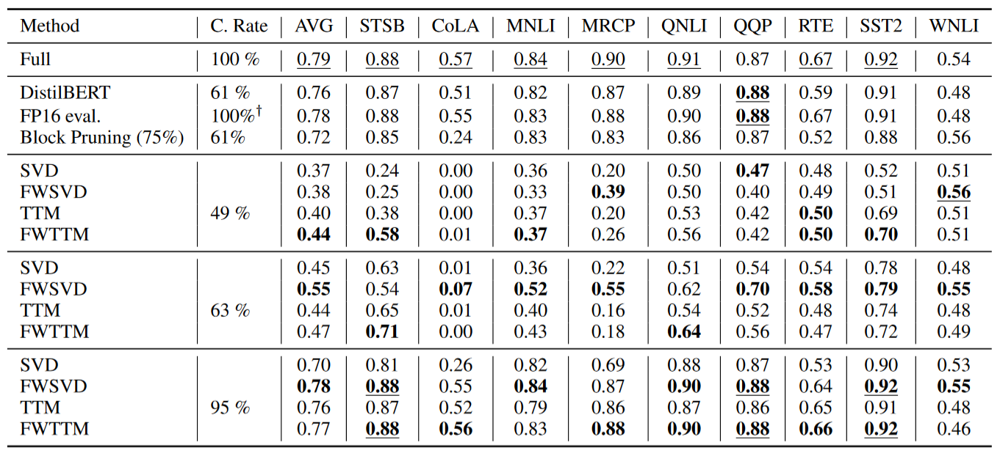

# Introduction

This repository contains code for reproducing experiments from the PACLIC-2023 paper **A Computational Study of Matrix Decomposition Methods for Compression of Pre-trained Transformer**.
In this paper we studied different matrix decompositions to compress Fully-Connected layers of a Transformer models (BERT and BART). Specifically, we apply Singular Value Decomposition(SVD) and Tensor Train Matrix(TTM) decomposition to represent the fully connected layers in a compressed form. We extend the FWSVD approach by adding Fisher information to the TTM decomposition and present a novel method called FWTTM.


## Quick Start

```bash
pip install -r requirements.txt
```

### Running on GLUE benchmark. 
Our code is based on the HuggingFace [code](https://github.com/huggingface/transformers/blob/main/examples/pytorch/text-classification/run_glue.py) for GLUE. So most of args should work for this script too. 
Benchmark based on GLUE which is made up of a total of $9$ different tasks. Here is how to run the script:

```bash
model = "bert-base-uncased"
random = 814084
python glue_trainer.py \
    --model_name_or_path $model  \
    --run_name $model-full-$random \
    --comp_func 'none' \
    --save_strategy "epoch" \
    --logging_strategy no \
    --do_bench --bench_on_eval \
    --bench_on_train \
    --max_bench_iter 1 \
    --batch_sizes 1 16 32 \
    --sequence_lengths 128 \
    --max_seq_length 128 \
    --per_device_train_batch_size 32 \
    --per_device_eval_batch_size 128 \
    --learning_rate 5e-5 \
    --num_train_epochs 2 \
    --evaluation_strategy 'epoch' \
    --seed $random \
    --output_dir ./data_eval/ \
    --overwrite_output_dir \
    --do_train \ 
    --do_eval 
```
This script will train and eval bert-base model for GLUE, and then output the results with GPU and CPU utilization.
To train model with compression function you can change script to:

```bash
for model in "bert-base-uncased"
do
	for ranks in 10 60 110 
	do
		for random in 39512 
		do
			python glue_trainer.py \
				--model_name_or_path $model  \
				--run_name $model-TTM-$ranks-$random \
				--comp_func 'ttm_ffn' --rank $ranks \
				--save_strategy "no" \
				--logging_strategy "no" \
				--do_bench --bench_on_eval \
				--bench_on_train \
				--max_bench_iter 1 \
				--batch_sizes 1 16 32 \
				--sequence_lengths 128 \
				--max_seq_length 128 \
				--per_device_train_batch_size 32 \
				--per_device_eval_batch_size 128 \
				--learning_rate 5e-5 \
				--tt_ranks $ranks $ranks $ranks \
				--tt_input_dims 12 2 2 16 \
				--tt_output_dims 32 3 2 16 \
				--num_train_epochs 2 \
				--evaluation_strategy 'epoch' \
				--seed $random \
				--output_dir './bert-base-uncased-ttm_ffn/'\
				--do_train \
                --double_train \ 
                --do_eval \
				--overwrite_output_dir
		done
	done
done
```
Here `svd_ffn_w` is SVD (all models available at `exps/models.py`) and `__rank__` is SVD rank. `--double_train` is the function for additional training after svd compression, in some cases gives better results.

| model    | score    | size(MB) | size(M param) | SPS       | train speed | inf speed | used_cpu | used_cpu_mem | used_gpu | used_gpu_mem |
| -------- | -------- | -------- | ------------- | --------- | ----------- | --------- | -------- | ------------ | -------- | ------------ |
| bert     | 0.79508  | 417.6553 | 109.483778    | 513.44118 | 0.21948     | 0.078     | 35.40032 | 2644.8       | 44.9     | 1599         |
| **stsb** | **cola** | **mnli** | **mrpc**      | **qnli**  | **qqp**     | **rte**   | **sst2** | **wnli**     |          |              |
| 0.88816  | 0.57574  | 0.84928  | 0.90352       | 0.91338   | 0.87682     | 0.67508   | 0.92432  | 0.5493       |          |              |

### XSUM\DETOX

First script is same as [huggingface run_summarization.py](https://github.com/huggingface/transformers/blob/main/examples/pytorch/summarization/run_summarization.py). This script will train model on any bart-based seq2seq task, and generate model with additional fisher weight coefs

```bash
for random in 585534
do
    python ./xsum_trainer.py \
    --model_name_or_path "facebook/bart-base" \
    --tokenizer_name "facebook/bart-base"  \
    --run_name bart-xsum-wttm-dt-$ranks \
    --dataset_name xsum \
    --dataset_config "3.0.0" \
    --do_train \
    --do_predict \
    --comp_func "none" \
    --predict_with_generate \
    --seed $random \
    --evaluation_strategy "epoch" \
    --max_source_length 512 \
    --per_device_train_batch_size 16 \
    --per_device_eval_batch_size 32 \
    --learning_rate 3e-5 \
    --num_train_epochs 3 \
    --overwrite_output_dir \
    --save_strategy "no" \
    --source_prefix "" \
    --output_dir ./experiments_BART/BART_XSUM_$random
done
```

Second script is for compression and training a compressed model:
```bash
for ranks in 10 60 110
    do
        for random in 585534
        do
            python ./xsum_trainer.py \
            --model_name_or_path ./experiments_BART/BART_XSUM_$random \
            --tokenizer_name ./experiments_BART/BART_XSUM_$random \
            --run_name bart-xsum-wttm-dt-$ranks \
            --dataset_name xsum \
            --dataset_config "3.0.0" \
            --do_train \
            --do_predict \
            --tt_input_dims 8 12 8 \
            --tt_output_dims 12 16 16 \
            --tt_ranks $ranks $ranks \
            --comp_func "ttm_ffn_bart" \
            --rank $ranks \
            --predict_with_generate \
            --seed $random \
            --evaluation_strategy "epoch" \
            --max_source_length 512 \
            --per_device_train_batch_size 16 \
            --per_device_eval_batch_size 32 \
            --learning_rate 3e-5 \
            --num_train_epochs 3 \
            --overwrite_output_dir \
            --save_strategy "no" \
            --source_prefix "" \
            --output_dir ./experiments_BART/BART_XSUM_$random/BART_XSUM_dt_ttm_ffn_bart_$ranks_$random
        done
    done
```

## Details

For evaluate gpu/cpu metrics we use pynvml library. Model only evaluate during evalatuation process.

You can also get scores without training model by directly using `synthetic_benchmark.py` script.

```bash
python synthetic_benchmark.py \
    --model_name_or_path 'gpt2'  \
    --run_name 'gpt2-full' \
    --comp_func 'none' \
    --do_bench --bench_on_eval \
    --bench_on_train \
    --max_bench_iter 1 \
    --batch_sizes 1 16 32 \
    --sequence_lengths 128 \
    --max_seq_length 128 \
    --seed 42 \
    --output_dir ./data_eval_gpt/
```

Data folder contains evaluation results for gpt2/bert-base-cased/distilbert/pruned-bert on 3090. This can be used as example.

## Experiments

All the discussed in paper compression methods are located in the `exps` folder and can be applied in the main GLUE evaluation script using `--comp_func` flag :

1. Attnetion head pruning, based on the paper ["Are Sixteen Heads Really Better than One?"](https://arxiv.org/abs/1905.10650) and its [implementation](https://github.com/huggingface/transformers/tree/main/examples/research_projects/bertology) ```random_head```
2. Vanilla SVD ```our_ffn```
3. Fisher-Weighted SVD introduced in ["Language model compression with weighted low-rank factorization"](https://arxiv.org/abs/2207.00112)  ```svd_ffn_w_T``` or ```svd_ffn_w```
4. TTM () ```ttm_ffn```
5. FWTTM ```ttm_ffn_w```

For sequence-to-sequence models:

1. Standart SVD ```svd_ffn_bart```
2. Weighted SVD ```svd_ffn_w_bart```
3. TTM ```ttm_ffn_bart```
4. FWTTM ```ttm_ffn_w_bart```

Additional methods can be found in `exps/models.py` and `exps/models_bart.py`.

## On the reproducibility of paper results
Due to the specifics of GPUs, drivers and architectures the benchmark should only be performed on immutable environment. The same script running on different gpus will give different results. So, the quality and speed of compression can be compared only within one environment. The environment setup for the experiments in the paper is available in `/data_eval/env_info.csv`.


## Results 

Below we present the results from our paper:

